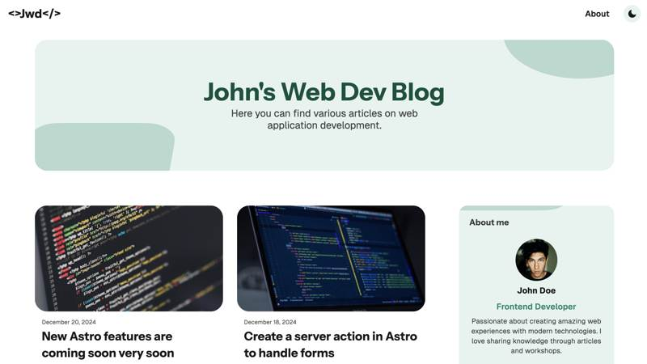
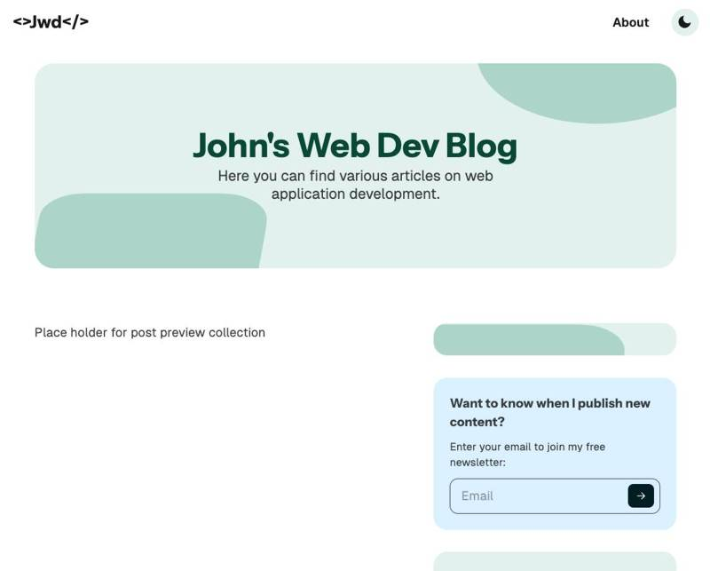

# Understanding the Project Structure

## The Site

We’re going to build the following site:

It will include:

- A homepage that displays a list of posts.
- A post page that shows the content of a single post.
- A full “About” page that presents the author’s experience.

Our starting point looks like this:

Now let’s explore the project structure.

## Structure

Here’s an overview of the main root folders in this project:

- **Assets**: Images, fonts, and other static resources.
- **Styles**: Global styles and Tailwind configuration.
- **Components**: Reusable building blocks that can be used across different pages.
- **Layouts**: As we saw in the basic examples, layouts wrap pages with a shared structure. In this project, we’re also using **named slots**, which makes them more flexible.
- **Pages**: The actual application pages, composed using layouts and components.
- **Pods**: This is where the domain logic lives. Each pod has its own components, services, and models.

> _Why not just put everything inside the **pages** folder?_  
> Astro treats every file in **pages** as a potential route. If you place components there, Astro might mistakenly render them as pages. You can work around this by prefixing filenames with an underscore, but it’s cleaner and more maintainable to keep things organized in their own folders.  
> See the docs for more details: https://docs.astro.build/en/guides/routing/#excluding-pages

In the **astro.config.mjs** file, we’ve added the **tailwindcss** plugin (Astro provides a CLI command to install it easily).

Finally, the **tsconfig.json** file configures TypeScript. In this project, we use it to define path aliases, so we can import modules with the `#/` prefix instead of long relative paths.
