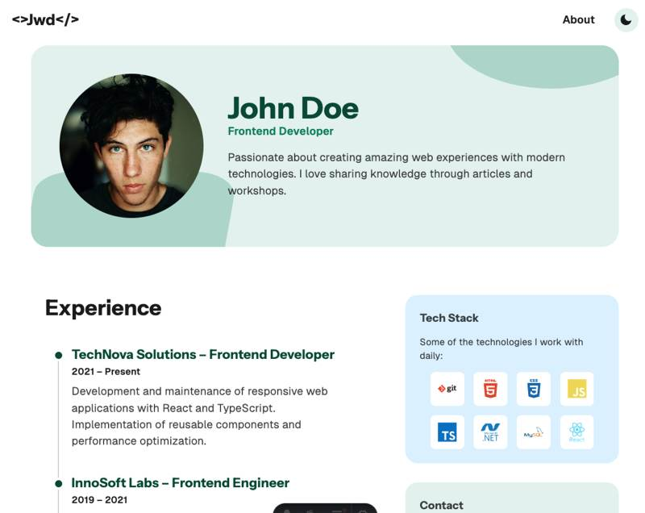

# 08 Experience Lab

We’ve learned a lot… but we haven’t yet applied our knowledge to a real-world scenario.  

Time to get our hands dirty in this hands-on lab!  

## Lab Overview

If you click on the About page, you’ll see an empty page. Our goal is to display the user’s list of experiences there.  

We’ll use the knowledge gained in the previous modules to implement this feature.  

First, we’ll explain the problem. Then we’ll provide tips and hints to help you solve it.  

## Goal

Let’s run the project:  

```bash
npm run dev
```  

If you click on the About page, you should see an empty page.  

  

Our goal is to display something like this:  

  

## Loading Data

We already have our Content Island project connected to Contentful.  

Looking at the model, we can see that it includes both a list of experiences and an **Experience** model.  

  

We’ll start by loading data from Contentful.  

We have an _experience-collection_ pod available.  

Let’s define a model. In Content Island we have:  

- An **Experience Section** model that loads all experiences plus the section heading.  
- An **Experience** model that represents a single experience.  

In Content Island, you can generate a model that includes nested collections, so the model would look like this:  

_./src/pods/experience-collection/experience-collection.model.ts_

```ts
export interface Experience {
  id: string;
  language: "en";
  company: string;
  role: string;
  period: string;
  description: string;
}

export interface ExperienceSection {
  id: string;
  language: "en";
  title: string;
  experienceCollection: Experience[];
}
```

Now let’s load the data from Contentful. This time, we’ll indicate that we want to load the nested collection.  

_./src/pods/experience-collection/experience-collection.api.ts_

```ts
import client from "#lib/client.ts";
import type { ExperienceSection } from "./experience-collection.model";

export const getExperience = async () =>
  await client.getContent<ExperienceSection>({
    contentType: "ExperienceSection",
    includeRelatedContent: true,
  });
```

Now let’s use it inside our component:  

_./src/pods/experience-collection/experience-collection.pod.astro_

```diff
---
- const experienceContent = {
-  title: 'Experience',
- };
+ import { getExperience } from "./experience-collection.api";
+ const experienceContent = await getExperience();
---

<section class="flex flex-1 flex-col gap-10 px-6" aria-labelledby="experience-section-heading">
  <h2 class="text-tbase-500/90 text-3xl font-bold" id="experience-section-heading">{experienceContent.title}</h2>
+  <ul>
+    {experienceContent.experienceCollection.map((experience) => (
+      <li>
+        <p>{experience.role} @ {experience.company}</p>
+        <p>{experience.period}</p>
+        <p>{experience.description}</p>
+      </li>
+    ))}
+  </ul>
</section>
```

If you now go to the About page, you should see a list of experiences (without design yet).  

## Adding Styles

Let’s improve the styles of our component:  

```diff
<section class="flex flex-1 flex-col gap-10 px-6" aria-labelledby="experience-section-heading">
  <h2 class="text-tbase-500/90 text-3xl font-bold" id="experience-section-heading">{experienceContent.title}</h2>

-  <ul>
-    {experienceContent.experienceCollection.map((experience) => (
-      <li>
-        <p>{experience.role} @ {experience.company}</p>
-        <p>{experience.period}</p>
-        <p>{experience.description}</p>
-      </li>
-      ))}
-  </ul>
+  <div class="pl-4">
+    {
+      experienceContent.experienceCollection.map(exp => (
+        <div class="relative flex items-baseline gap-4 before:absolute before:top-5 before:left-[5px] before:z-[-1] before:h-full before:w-0.5 before:bg-gray-300 last:before:hidden">
+          <div class="flex flex-col">
+            <div class="bg-primary-700 dark:border-primary-50 dark:shadow-primary-50 h-3 w-3 rounded-full shadow-[0_0_0_4px] shadow-white dark:shadow-[0_0_0_5px]" />
+          </div>
+
+          <article class="pb-10">
+            <h3 class="text-primary-700 text-lg font-bold">
+              {exp.company} – {exp.role}
+            </h3>
+            <span class="text-tbase-500/90 mb-2 block text-sm font-semibold">{exp.period}</span>
+            <p>{exp.description}</p>
+          </article>
+        </div>
+      ))
+    }
+  </div>
</section>
```
